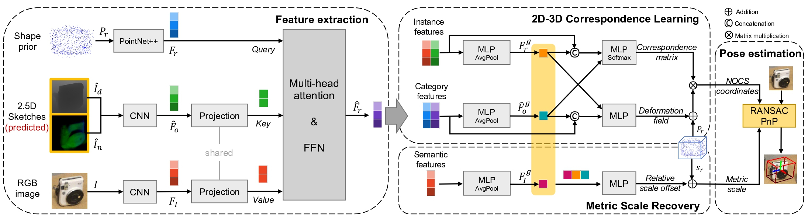

# DMSR

This repository contains code and resources related to the paper [RGB-based Category-level Object Pose Estimation via Decoupled Metric Scale Recovery](https://arxiv.org/abs/2309.10255) by Jiaxin Wei, Xibin Song, Weizhe Liu, Laurent Kneip, Hongdong Li, and Pan Ji.




## Abstract

> While showing promising results, recent RGB-D camera-based category-level object pose estimation methods have restricted applications due to the heavy reliance on depth sensors. RGB-only methods provide an alternative to this problem yet suffer from inherent scale ambiguity stemming from monocular observations. In this paper, we propose a novel pipeline that decouples the 6D pose and size estimation to mitigate the influence of imperfect scales on rigid transformations. Specifically, we leverage a pre-trained monocular estimator to extract local geometric information, mainly facilitating the search for inlier 2D-3D correspondence. Meanwhile, a separate branch is designed to directly recover the metric scale of the object based on category-level statistics. Finally, we advocate using the RANSAC-PnP algorithm to robustly solve for 6D object pose. Extensive experiments have been conducted on both synthetic and real datasets, demonstrating the superior performance of our method over previous state-of-the-art RGB-based approaches, especially in terms of rotation accuracy.


## Requirements

We have tested our code with the following configurations
- Ubuntu 20.04
- PyTorch 1.8.0
- torchvision 0.9.0
- CUDA 11.1


## Installation

Create virtual environment
```
conda create -n dmsr python=3.6
conda activate dmsr
pip install -r requirements.txt
```

Build PointNet++ (source code has been modified to adapt to higher versions of PyTorch)
```
cd DMSR/pointnet2/pointnet2
python setup.py install
```

Build nn_distance
```
cd DMSR/lib/nn_distance
python setup.py install
```

## Dataset

Please follow the instructions in [object-deformnet](https://github.com/mentian/object-deformnet?tab=readme-ov-file#datasets) to prepare the NOCS dataset. The segmentation results from Mask R-CNN and predictions of NOCS can also be found [here](https://github.com/mentian/object-deformnet/tree/master?tab=readme-ov-file#evaluation).

**Important**: delete `obj_models/val/02876657/d3b53f56b4a7b3b3c9f016d57db96408` before preprocessing the datasets, otherwise it will cause errors. 

The extended dataset containing depth and normal predictions can be downloaded [here](https://drive.google.com/drive/folders/1Hna4DJImIvfIo47Hm0fiBMqh3KD5lIOQ?usp=sharing). Please use the following command to merge the files in each folder after downloading:
```
cat <folder_name>* > <folder_name>.tar.gz
tar xzvf <folder_name>.tar.gz
```

Now the `DMSR/datasets` directory is organized as follows:
```
datasets
├── NOCS
│   ├── CAMERA
│   │   ├── train
│   │   └── val
│   ├── Real
│   │   ├── train
│   │   └── test
│   ├── gts
│   │   ├── val
│   │   └── real_test
│   └── obj_models
│       ├── train
│       ├── val
│       ├── real_train
│       └── real_test
├── dpt_output
│   ├── CAMERA
│   │   ├── train
│   │   └── val
│   └── Real
│       ├── train
│       └── test
└── results
    ├── mrcnn_results
    │   ├── real_test
    │   └── val
    └── nocs_results
        ├── real_test
        └── val
```

## Training
```
python train.py --dataset CAMERA --result_dir checkpoints/camera
```
or
```
python train.py --dataset CAMERA+Real --result_dir checkpoints/real
```

## Evaluation

Please download our trained models [here](https://drive.google.com/file/d/1dITE1CauVmh3lJcVklR9zuemmf7arJi1/view?usp=drive_link) and put it in the `DMSR/pretrained` directory.

To evaluate CAMERA data, run
```
python evaluate.py --data val --model ./pretrained/camera_model.pth --result_dir ./results/eval_camera
```

To evaluate REAL data, run
```
python evaluate.py --data real_test --model ./pretrained/real_model.pth --result_dir ./results/eval_real
```

We also provide processed files for fast verification of our results reported in the paper. Please download our processed files [here](https://drive.google.com/file/d/1JqcovPX5iy2VkyN2rHn4holbovqGORro/view?usp=sharing) and put it in the `DMSR/results` directory. Then, you can run the above commands to see the results shown in the terminal.

## Video

Please check our video for more qualitative results.

[](https://www.youtube.com/watch?v=q5Mggn5VHrc)

The predictions and ground truths are shown by red and green bounding boxes, respectively.


## Citation

If you find our work useful in your research, please cite our paper:

```
@misc{wei2023rgbbased,
      title={RGB-based Category-level Object Pose Estimation via Decoupled Metric Scale Recovery}, 
      author={Jiaxin Wei and Xibin Song and Weizhe Liu and Laurent Kneip and Hongdong Li and Pan Ji},
      year={2023},
      eprint={2309.10255},
      archivePrefix={arXiv},
      primaryClass={cs.CV}
}
```

If you have any questions, please feel free to contact Jiaxin Wei (weijx1421@foxmail.com).


## Acknowledgment

Our code is developed based on [SGPA](https://github.com/ck-kai/SGPA) and we extend the [NOCS](https://github.com/hughw19/NOCS_CVPR2019) dataset using [Omnidata](https://github.com/EPFL-VILAB/omnidata) models for training.


